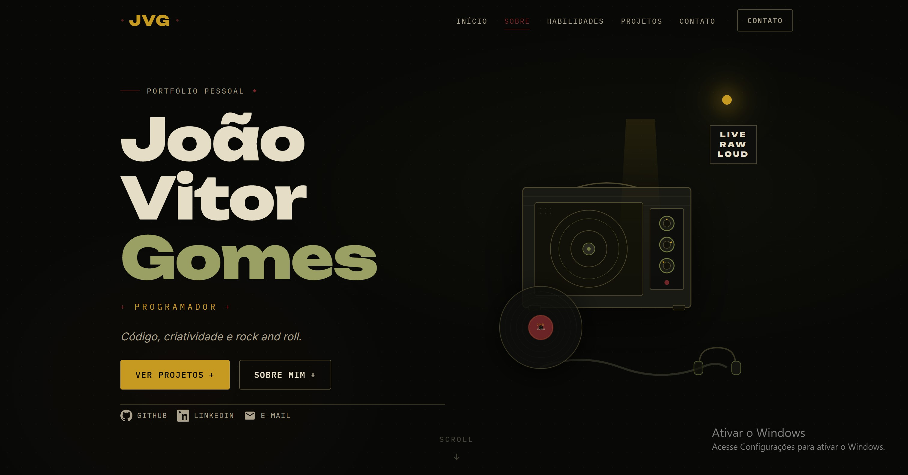

# Portfólio — João Vitor Gomes

Portfólio pessoal desenvolvido para apresentar minhas habilidades, projetos e formas de contato.

Eu me chamo João Vitor, nasci em 2008 e sou apaixonado por games, rock e programação. Gosto de aprender novas tecnologias, desenvolver projetos e usar a criatividade para transformar ideias em páginas e aplicações funcionais.

Tenho interesse em desenvolvimento web e no uso de inteligência artificial como apoio na criação, organização e melhoria dos meus projetos.

## Status do projeto

Concluído.

## Projeto publicado

Acesse o portfólio:

https://thelastofg.github.io/portfolio-alpha/

## Tecnologias utilizadas

* HTML5
* CSS3
* JavaScript
* CSS Grid
* Flexbox
* Media Queries
* Git
* GitHub
* GitHub Pages
* SVG

O projeto foi desenvolvido somente com tecnologias nativas da web, sem frameworks ou bibliotecas externas de CSS ou JavaScript.

## Funcionalidades

* Navegação entre as seções da página
* Menu responsivo para dispositivos móveis
* Seção de apresentação pessoal
* Seção Sobre mim com foto
* Seção de habilidades
* Cards de projetos reais
* Links para os repositórios e sites publicados
* Formulário de contato com validação em JavaScript
* Links para GitHub, LinkedIn, e-mail e WhatsApp
* Animações e microinterações feitas com CSS e JavaScript puro
* Layout responsivo para celular, tablet e computador

## Seções do portfólio

* Início
* Sobre mim
* Habilidades
* Projetos
* Contato
* Rodapé

## Projetos apresentados

### BlackShield

Website responsivo desenvolvido para apresentar os serviços e a identidade visual da BlackShield.

* [Ver projeto](https://blackshieldcar.com.au)
* [Ver código](https://github.com/theLASTofG/BlackShield)

### Gloria Martins

Website profissional desenvolvido para apresentar serviços terapêuticos, informações sobre a profissional e formas de contato.

* [Ver projeto](https://gloria-martins.com)
* [Ver código](https://github.com/theLASTofG/GloriaMartins)

## Estrutura do projeto

```text
portfolio/
├── css/
│   └── style.css
├── img/
│   ├── joaoIMG.jpeg
│   ├── blackshield-preview.svg
│   └── gloria-martins-preview.svg
├── js/
│   └── script.js
├── index.html
└── README.md
```

## Como executar localmente

1. Faça o download ou clone este repositório:

```bash
git clone https://github.com/theLASTofG/portfolio-alpha.git
```

2. Entre na pasta do projeto:

```bash
cd portfolio-alpha
```

3. Abra o arquivo `index.html` no navegador.

Também é possível utilizar a extensão Live Server do Visual Studio Code.

## Protótipo

O protótipo de alta fidelidade foi criado no Google Stitch.

[Visualizar protótipo no Google Stitch](https://stitch.withgoogle.com/preview/107545981665134074?node-id=c766176542944fcf9a2d08ab04f1ed1d)

## Prévia do projeto



## Responsividade

A interface foi desenvolvida para funcionar em:

* smartphones;
* tablets;
* notebooks;
* monitores desktop.

O layout utiliza Media Queries, Flexbox e CSS Grid para reorganizar os elementos conforme o tamanho da tela.

## Contato

* [GitHub](https://github.com/theLASTofG)
* [LinkedIn](https://www.linkedin.com/in/jo%C3%A3o-resende-7b2411369/)
* [E-mail](mailto:joaohuhuhun@gmail.com)
* [WhatsApp](https://wa.me/5531982515757)

## Autor

Desenvolvido por **João Vitor Gomes**.
